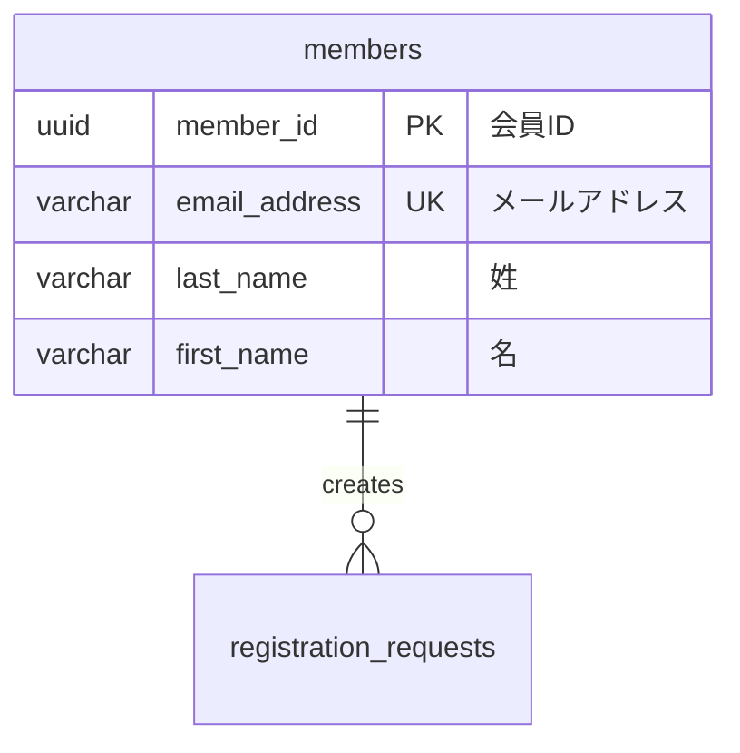

# データベース設計作成ルール

## 基本ルール

### ファイル保存場所
- ER図: `docs/design/source/database/er.rst`
- テーブル設計: `docs/design/source/database/[テーブル名小文字].rst`
- テンプレート: `docs/design/source/database/template.rst`

### ファイル命名規則
- **テーブル毎のファイル作成を基本とする**
- テーブル設計ファイル名: テーブル名を小文字に変換（例: `members` → `members.rst`）
- アンダースコア区切りはそのまま維持（例: `cart_items` → `cart_items.rst`）

### 現在のファイル構成例
- `er.rst`: 全体ER図
- `members.rst`: membersテーブル設計
- `registration_requests.rst`: registration_requestsテーブル設計  
- `member_events.rst`: member_eventsテーブル設計
- `template.rst`: テーブル設計テンプレート

## インプット情報

### 主要なインプット
1. **GitHubのissue**: 機能要件の確認
2. **ユーザーストーリー**: `docs/design/source/user_story/*.rst` のAgile形式要求
3. **ドメインモデル**: `docs/design/source/domain_model.rst` の用語・エンティティ・クラス図
4. **ユースケース**: `docs/design/source/usecase/*.rst` のユースケース図・記述

### 推奨ワークフロー
1. **GitHubのissue確認**: 機能要件の確認
2. **ユーザーストーリー参照**: 関連するユーザーストーリー（Agile形式）を確認
3. **ドメインモデル参照**: エンティティ名・用語・クラス図を確認
4. **ユースケース参照**: ビジネスロジックとシステム操作を確認
5. **ER図更新**: データベース全体設計の更新（← このステップ）
6. **テーブル毎設計作成**: 各テーブルの詳細設計を個別ファイルで作成

## ER図作成・更新ルール

### 必須作成・更新
- **全てのデータベース設計において、ER図の作成・更新は必須**
- 新機能開発時は必ず `docs/design/source/database/er.rst` を更新すること
- システム全体のテーブル構造とリレーションシップを定義

### フォーマット
- Mermaid形式のerDiagramを使用
- `docs/design/source/database/er.rst`に配置

### 記載内容
- テーブル名（小文字、snake_case）  
- 主要カラム（データ型、制約情報）
- リレーション（1:1, 1:N, N:N）
- 日本語コメント付き

### サンプル構造


## テーブル設計作成ルール

### テンプレート使用
- `docs/design/source/database/template.rst`をベースに作成
- 必須セクション: 概要、テーブル定義、制約定義、インデックス定義、ER図

### テーブル毎ファイル作成
- 1つのテーブルにつき1つのrstファイルを作成
- ファイル名はテーブル名と同じ（小文字、例: `members.rst`）
- template.rstの構造に従って詳細設計を記載

### カラム定義
- カラム名（英語、snake_case）
- 論理名（日本語）
- データ型（具体的なサイズ指定）
- NULL/NOT NULL制約
- デフォルト値
- 説明

### インデックス設計
- **PRIMARY KEY**: 主キー
- **外部キー**: 参照先テーブル、CASCADE動作
- **UNIQUE INDEX**: 一意制約
- **通常のINDEX**: 検索用途

### 制約・ビジネスルール
- データ整合性制約
- ビジネスロジック制約
- 運用ルール

## ファイル更新ルール

### database/index.rst 運用ルール

**基本構成（必須維持）**:

```rst
データベース設計
==========================================

.. toctree::
   :maxdepth: 2
   :caption: Contents:

   er
   [テーブル1]
   [テーブル2]
   [テーブル3]
   template
```

**新しいテーブル設計ファイル追加時の手順**:

1. **テーブル設計ファイル作成**
   - 新しいテーブル（例: `products`テーブル）の設計書を作成
   - ファイル名: `products.rst`
   - template.rstの構造に従って作成

2. **database/index.rst に追加**
   - `.. toctree::` セクションに新しいファイルを追加
   - ファイル名は拡張子（`.rst`）を除いて記載
   - templateより前に配置

3. **ER図の更新**
   - `er.rst` に新しいテーブルとリレーションを追加

4. **記載例**:
```rst
データベース設計
==========================================

.. toctree::
   :maxdepth: 2
   :caption: Contents:

   er
   members
   registration_requests
   member_events
   products
   template
```

**セクション構成ルール**:

- **ER図**: 常に最上位に配置（`er` のみ）
- **テーブル設計**: 各テーブルの個別設計ファイルを配置
- **テンプレート**: 常に最下位に配置（`template` のみ）
- テーブル追加順序は機能の重要度順または作成日順

**toctree設定**:
- `:maxdepth: 2` を使用
- `:caption: Contents:` を設定
- インデントは3スペースで統一

## 設計原則

### 命名規則
- テーブル名: 英小文字、snake_case、複数形（例: members, products）
- カラム名: 英小文字、snake_case（例: member_id, created_at）
- 外部キー: 参照先テーブル名_id（例: member_id, product_id）

### データ型選択
- ID系: UUID（gen_random_uuid()）
- 文字列: VARCHAR（適切なサイズ指定）
- 金額: DECIMAL(10,2)
- 日時: TIMESTAMP WITH TIME ZONE
- フラグ: BOOLEAN

### 必須カラム
- 主キー: [テーブル名単数形]_id（UUID型）
- 作成日時: created_at（TIMESTAMP WITH TIME ZONE, NOT NULL, DEFAULT CURRENT_TIMESTAMP）
- 更新日時: updated_at（TIMESTAMP WITH TIME ZONE, NOT NULL, DEFAULT CURRENT_TIMESTAMP）

## 品質チェック

### 作成時チェックポイント
- [ ] ER図にすべてのテーブルとリレーションが記載されている
- [ ] テーブルファイルがtemplate.rstの構造に従っている
- [ ] 外部キー制約が正しく定義されている
- [ ] インデックスが適切に設計されている
- [ ] ビジネスルールが明記されている
- [ ] `docs/design/source/database/index.rst`に新しいテーブルファイルが追加されている
- [ ] ファイル命名規則に従っている（テーブル名.rst）
- [ ] created_at/updated_atが適切に定義されている

### レビューポイント
- データ整合性の確保
- パフォーマンス考慮
- 運用性の確保
- ビジネス要件との整合性
- テーブル毎の独立性確保

## 関連ファイル参照
- ユーザーストーリー: `docs/design/source/user_story/`
- ユースケース: `docs/design/source/usecase/`
- ドメインモデル: `docs/design/source/domain_model.rst`
- プロジェクト計画: `docs/design/source/project_plan.rst`
