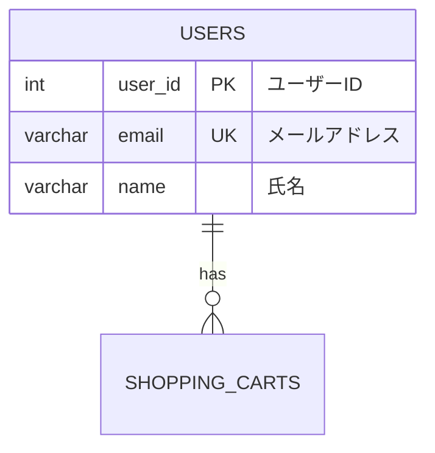

# データベース設計作成ルール

## 基本ルール

### ファイル保存場所
- ER図: `docs/design/source/database/er.rst`
- テーブル設計: `docs/design/source/database/[テーブル名小文字].rst`
- テーブル一覧: `docs/design/source/database/table_list.rst`
- テンプレート: `docs/design/source/database/template.rst`

### ファイル命名規則
- テーブル設計ファイル名: テーブル名を小文字に変換（例: `USERS` → `users.rst`）
- アンダースコア区切りはそのまま維持（例: `CART_ITEMS` → `cart_items.rst`）

## インプット情報

### 主要なインプット
1. **GitHubのissue**: 機能要件の確認
2. **ユーザーストーリー**: `docs/design/source/user_story/*.rst` のAgile形式要求
3. **ドメインモデル**: `docs/design/source/domain_model.rst` の用語・エンティティ・クラス図
4. **ユースケース**: `docs/design/source/usecase/*.rst` のユースケース図・記述

### 推奨ワークフロー
1. **GitHubのissue確認**: 機能要件の確認
2. **ユーザーストーリー参照**: 関連するユーザーストーリー（Agile形式）を確認
3. **ドメインモデル参照**: エンティティ名・用語・クラス図を確認
4. **ユースケース参照**: ビジネスロジックとシステム操作を確認
5. **ER図作成**: データベース設計（← このステップ）
6. **テーブル設計作成**: 詳細なテーブル設計を作成

## ER図作成ルール

### フォーマット
- Mermaid形式のerDiagramを使用
- `docs/design/source/database/er.rst`に配置

### 記載内容
- テーブル名（英大文字）
- 主要カラム（データ型、制約情報）
- リレーション（1:1, 1:N, N:N）
- 日本語コメント付き

### サンプル構造

## テーブル設計作成ルール

### テンプレート使用
- `docs/design/source/database/template.rst`をベースに作成
- 必須セクション: 説明、カラム、インデックス、制約・ビジネスルール

### カラム定義
- 名前（日本語）
- カラム名（英語、snake_case）
- 型（具体的なサイズ指定）
- NULL/NOT NULL制約
- デフォルト値
- 外部キー参照
- 属性（auto_increment, UNIQUE等）

### インデックス設計
- **PRIMARY KEY**: 主キー
- **外部キー**: 参照先テーブル、CASCADE動作
- **UNIQUE INDEX**: 一意制約
- **通常のINDEX**: 検索用途

### 制約・ビジネスルール
- データ整合性制約
- ビジネスロジック制約
- 運用ルール

## ファイル更新ルール

### table_list.rst更新
- 新しいテーブルファイル作成時は必ず`docs/design/source/database/table_list.rst`を更新
- `:doc:`テーブル名``形式でリンク追加
- テーブルの簡潔な説明を併記

### 索引への追加
- `docs/design/source/database/index.rst`の適切な`.. toctree::`セクションに新ファイルを追加
- テーブル設計ファイルは「テーブル設計詳細」セクションに追加
- ファイル名は拡張子（`.rst`）を除いて記載

## 設計原則

### 命名規則
- テーブル名: 英大文字、複数形（例: USERS, PRODUCTS）
- カラム名: 英小文字、snake_case（例: user_id, created_at）
- 外部キー: 参照先テーブル名_id（例: user_id, product_id）

### データ型選択
- ID系: INT（auto_increment）
- 文字列: VARCHAR（適切なサイズ指定）
- 金額: DECIMAL(10,2)
- 日時: DATETIME
- フラグ: BOOLEAN

### 必須カラム
- 主キー: [テーブル名]_id
- 作成日時: created_at（DATETIME, NOT NULL, DEFAULT CURRENT_TIMESTAMP）
- 更新日時: updated_at（必要に応じて）

## 品質チェック

### 作成時チェックポイント
- [ ] ER図にすべてのテーブルとリレーションが記載されている
- [ ] テーブルファイルがtemplate.rstの構造に従っている
- [ ] 外部キー制約が正しく定義されている
- [ ] インデックスが適切に設計されている
- [ ] ビジネスルールが明記されている
- [ ] table_list.rstが更新されている
- [ ] `docs/design/source/database/index.rst`の適切なセクションにリンクが追加されている
- [ ] ファイル命名規則に従っている

### レビューポイント
- データ整合性の確保
- パフォーマンス考慮
- 運用性の確保
- ビジネス要件との整合性

## 関連ファイル参照
- ユーザーストーリー: `docs/design/source/user_story/`
- ユースケース: `docs/design/source/usecase/`
- ドメインモデル: `docs/design/source/domain_model.rst`
- プロジェクト計画: `docs/design/source/project_plan.rst`
