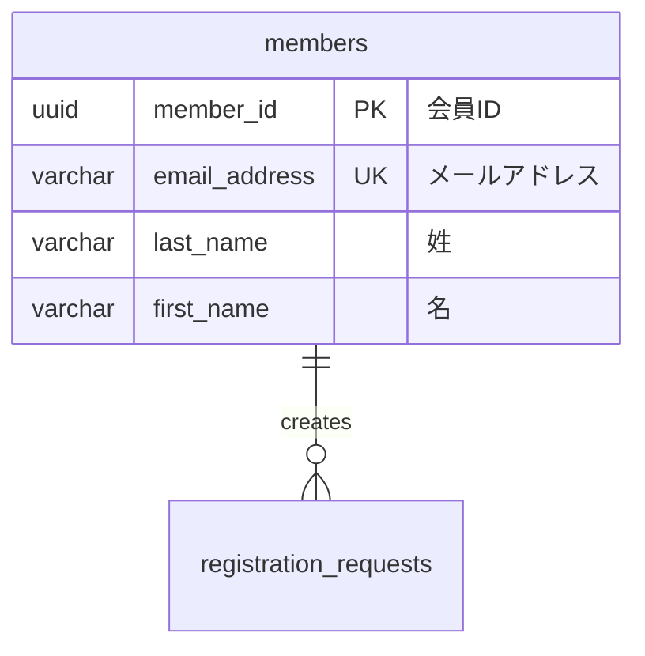

# データベース設計作成ルール

## 基本ルール

### ファイル保存場所
- ER図: `docs/design/source/database/er.rst`
- テーブル設計: `docs/design/source/database/[テーブル名小文字].rst`
- テンプレート: `docs/design/source/database/template.rst`

### ファイル命名規則
- **テーブル毎のファイル作成を基本とする**
- テーブル設計ファイル名: テーブル名を小文字に変換（例: `members` → `members.rst`）
- アンダースコア区切りはそのまま維持（例: `cart_items` → `cart_items.rst`）

### 現在のファイル構成例
- `er.rst`: 全体ER図
- `members.rst`: membersテーブル設計
- `registration_requests.rst`: registration_requestsテーブル設計  
- `member_events.rst`: member_eventsテーブル設計
- `template.rst`: テーブル設計テンプレート

## インプット情報

### 主要なインプット
1. **GitHubのissue**: 機能要件の確認
2. **ユーザーストーリー**: `docs/design/source/user_story/*.rst` のAgile形式要求
3. **ドメインモデル**: `docs/design/source/domain_model.rst` の用語・エンティティ・クラス図
4. **ユースケース**: `docs/design/source/usecase/*.rst` のユースケース図・記述

### 推奨ワークフロー
1. **GitHubのissue確認**: 機能要件の確認
2. **ユーザーストーリー参照**: 関連するユーザーストーリー（Agile形式）を確認
3. **ドメインモデル参照**: エンティティ名・用語・クラス図を確認
4. **ユースケース参照**: ビジネスロジックとシステム操作を確認
5. **ER図更新**: データベース全体設計の更新（← このステップ）
6. **テーブル毎設計作成**: 各テーブルの詳細設計を個別ファイルで作成

## ER図作成・更新ルール

### 必須作成・更新
- **全てのデータベース設計において、ER図の作成・更新は必須**
- 新機能開発時は必ず `docs/design/source/database/er.rst` を更新すること
- システム全体のテーブル構造とリレーションシップを定義

### フォーマット
- Mermaid形式のerDiagramを使用
- `docs/design/source/database/er.rst`に配置

### 記載内容
- テーブル名（小文字、snake_case）  
- 主要カラム（データ型、制約情報）
- リレーション（1:1, 1:N, N:N）
- 日本語コメント付き

### サンプル構造


## テーブル設計作成ルール

### テンプレート使用
- `docs/design/source/database/template.rst`をベースに作成
- 必須セクション: 概要、テーブル定義、制約定義、インデックス定義、ER図

### テーブル毎ファイル作成
- 1つのテーブルにつき1つのrstファイルを作成
- ファイル名はテーブル名と同じ（小文字、例: `members.rst`）
- template.rstの構造に従って詳細設計を記載

### カラム定義
- カラム名（英語、snake_case）
- 論理名（日本語）
- データ型（具体的なサイズ指定）
- NULL/NOT NULL制約
- デフォルト値
- 説明

### インデックス設計
- **PRIMARY KEY**: 主キー
- **外部キー**: 参照先テーブル、CASCADE動作
- **UNIQUE INDEX**: 一意制約
- **通常のINDEX**: 検索用途

### 制約・ビジネスルール
- データ整合性制約
- ビジネスロジック制約
- 運用ルール

## ファイル更新ルール

### database/index.rst 運用ルール

**基本構成（必須維持）**:

```rst
データベース設計
==========================================

.. toctree::
   :maxdepth: 2
   :caption: Contents:

   er
   [テーブル1]
   [テーブル2]
   [テーブル3]
   template
```

**新しいテーブル設計ファイル追加時の手順**:

1. **テーブル設計ファイル作成**
   - 新しいテーブル（例: `products`テーブル）の設計書を作成
   - ファイル名: `products.rst`
   - template.rstの構造に従って作成

2. **database/index.rst に追加**
   - `.. toctree::` セクションに新しいファイルを追加
   - ファイル名は拡張子（`.rst`）を除いて記載
   - templateより前に配置

3. **ER図の更新**
   - `er.rst` に新しいテーブルとリレーションを追加

4. **記載例**:
```rst
データベース設計
==========================================

.. toctree::
   :maxdepth: 2
   :caption: Contents:

   er
   members
   registration_requests
   member_events
   products
   template
```

**セクション構成ルール**:

- **ER図**: 常に最上位に配置（`er` のみ）
- **テーブル設計**: 各テーブルの個別設計ファイルを配置
- **テンプレート**: 常に最下位に配置（`template` のみ）
- テーブル追加順序は機能の重要度順または作成日順

**toctree設定**:
- `:maxdepth: 2` を使用
- `:caption: Contents:` を設定
- インデントは3スペースで統一

## 設計原則

### 基本設計方針

- PostgreSQL 13以降での実装を想定
- UUID主キーによる一意性保証
- 外部キー制約による参照整合性の確保
- 正規化による重複データの排除
- インデックス最適化によるパフォーマンス向上

### 命名規則
- テーブル名: 英小文字、snake_case、複数形（例: members, products）
- カラム名: 英小文字、snake_case（例: member_id, created_at）
- 外部キー: 参照先テーブル名_id（例: member_id, product_id）

### データ型選択
- ID系: UUID（gen_random_uuid()）
- 文字列: VARCHAR（適切なサイズ指定）
- 金額: DECIMAL(10,2)
- 日時: TIMESTAMP WITH TIME ZONE
- フラグ: BOOLEAN

### 必須カラム
- 主キー: [テーブル名単数形]_id（UUID型）
- 作成日時: created_at（TIMESTAMP WITH TIME ZONE, NOT NULL, DEFAULT CURRENT_TIMESTAMP）
- 更新日時: updated_at（TIMESTAMP WITH TIME ZONE, NOT NULL, DEFAULT CURRENT_TIMESTAMP）

## 品質チェック

### 作成時チェックポイント
- [ ] ER図にすべてのテーブルとリレーションが記載されている
- [ ] テーブルファイルがtemplate.rstの構造に従っている
- [ ] 外部キー制約が正しく定義されている
- [ ] インデックスが適切に設計されている
- [ ] ビジネスルールが明記されている
- [ ] `docs/design/source/database/index.rst`に新しいテーブルファイルが追加されている
- [ ] ファイル命名規則に従っている（テーブル名.rst）
- [ ] created_at/updated_atが適切に定義されている

### レビューポイント
- データ整合性の確保
- パフォーマンス考慮
- 運用性の確保
- ビジネス要件との整合性
- テーブル毎の独立性確保

## 関連ファイル参照
- ユーザーストーリー: `docs/design/source/user_story/`
- ユースケース: `docs/design/source/usecase/`
- ドメインモデル: `docs/design/source/domain_model.rst`
- プロジェクト計画: `docs/design/source/project_plan.rst`

## ER図更新・管理ルール

### 新機能追加時の手順

1. **ER図の更新**: 新しいテーブル追加時は必ず `docs/design/source/database/er.rst` のER図を更新
2. **詳細設計書作成**: 個別テーブルの詳細設計書も同時に作成
3. **リレーション検証**: 既存テーブルとの関係性を慎重に検討し、データ整合性を確保
4. **インデックス最適化**: 新しいアクセスパターンに合わせてインデックス戦略を見直し
5. **制約の追加**: 必要に応じて新しいチェック制約や外部キー制約を追加

### コメントアウト運用

- 将来実装予定のテーブルは、ER図内でコメントアウト（%%）して記載
- 実装時にコメントアウトを解除し、実際のリレーションを定義
- 設計変更があった場合は、コメントアウト部分も更新

### テンプレート構造

新しいテーブル追加時のMermaid構文例：

```text
new_table_name {
    UUID id PK "主キーの説明"
    UUID foreign_id FK "外部キーの説明"
    VARCHAR column_name "カラムの説明"
    INTEGER numeric_column "数値カラムの説明"
    TIMESTAMP created_at "作成日時"
    TIMESTAMP updated_at "更新日時"
}

%% リレーション定義例
parent_table ||--o{ new_table_name : "リレーションの説明"
```

## 管理情報・運用ルール

### 作成履歴管理

- 作成日と初期作成の経緯を記録
- 機能追加に伴う段階的拡張の履歴管理

### レビュー要件

- **新機能追加時**: データベース設計の全体整合性確認必須
- **四半期ごと**: パフォーマンス監視結果に基づく最適化検討
- **年次**: セキュリティ要件の見直しとアップデート
- **重要変更時**: アーキテクチャレビューの実施

### 品質基準

- すべてのテーブルに created_at, updated_at カラムを必須とする
- UUID主キーによる一意性保証を標準とする
- 外部キー制約による参照整合性を必ず設定する
- 適切なインデックス設計によるパフォーマンス確保

### 関連ドキュメントとの連携

- `docs/design/source/database/template.rst`: データベーステーブル設計テンプレート
- 個別テーブル設計書との整合性維持

## テンプレート使用・更新ルール

### このテーブル作成時の必須作業

1. **全体ER図の更新**: `docs/design/source/database/er.rst` ページのMermaid ER図にこのテーブルを追加
2. **リレーション定義**: 他のテーブルとの関係を全体ER図に反映
3. **テーブル一覧更新**: 全体ER図ページのテーブル一覧にこのテーブルを追加
4. **制約サマリー更新**: 新しい制約があれば全体ER図ページに反映

### Mermaid構文例

このテーブルを全体ER図に追加する際のMermaid構文：

```text
[ テーブル名 ] {
    [ データ型 ] [ カラム名1 ] PK "[ 説明 ]"
    [ データ型 ] [ カラム名2 ] FK "[ 説明 ]"
    [ データ型 ] [ カラム名3 ] "[ 説明 ]"
    TIMESTAMP created_at "作成日時"
    TIMESTAMP updated_at "更新日時"
}

%% 他テーブルとのリレーション
[ 親テーブル名 ] ||--o{ [ テーブル名 ] : "[ リレーション説明 ]"
```

### 設計整合性チェックリスト

- [ ] 全体ER図にテーブルが追加されている
- [ ] リレーションシップが正しく定義されている  
- [ ] テーブル一覧に新しいテーブルが記載されている
- [ ] 制約サマリーに新しい制約が反映されている
- [ ] インデックス戦略が全体ER図に反映されている

## データ運用・保守ルール

### データメンテナンス

**定期メンテナンス**:
- 期限切れデータの削除
  - **実行頻度**: 毎日深夜2時（システム負荷の低い時間帯）
  - **対象条件**: created_at < CURRENT_DATE - INTERVAL '1 year'（保存期間1年を超過したデータ）
  - **実行方法**: バッチスクリプトによる自動削除、削除前のログ出力必須

- 統計情報の更新
  - **実行頻度**: 毎週日曜日深夜（定期メンテナンス時間）
  - **対象**: 全テーブルの統計情報（PostgreSQLのANALYZE）
  - **実行方法**: ANALYZE文の実行、実行結果の監視とアラート

**データアーカイブ**:
- アーカイブ対象: 1年以上経過した非アクティブデータ
- アーカイブ先: 別テーブル、外部ストレージ（AWS S3等）
- アーカイブ頻度: 四半期ごと（3ヶ月に1回）
- アーカイブ検証: データ整合性確認、復元テストの実施

### パフォーマンス管理

**想定クエリパターンと最適化**:
- 高頻度アクセス（ログイン認証等）: 単一カラムインデックス作成
- 中頻度アクセス（一覧表示等）: 複合インデックス作成、ORDER BY句の最適化
- 低頻度アクセス（管理機能等）: インデックス数を最小限に抑制
- レポート・分析クエリ: 読み取り専用レプリカの活用

**パーティショニング戦略**（大量データの場合）:
- パーティション方法: 日付レンジパーティション（年・月単位）
- パーティション単位: 月単位（アクセスパターンに応じて調整）
- パーティション管理: 自動パーティション作成、古いパーティションの自動削除

**レプリケーション設定**:
- 読み取り専用レプリカの活用: 分析・レポート処理用
- 非同期レプリケーション設定: マスター・スレーブ構成
- 読み書き分離の実装: アプリケーションレベルでの実装

**キャッシュ戦略**:
- キャッシュ対象: 頻繁にアクセスされるマスタデータ
- キャッシュ方式: Redis、アプリケーションレベルキャッシュ
- 無効化タイミング: データ更新時の即座な無効化、TTL設定

### セキュリティ管理

**暗号化**:
- 暗号化対象: 機密性の高い個人情報カラム（パスワード、クレジットカード情報等）
- 暗号化方式: AES-256、データベースレベル暗号化（TDE）
- キー管理: AWS KMS、専用キー管理システムによる暗号化キーの管理

**アクセス制御**:
- ユーザー権限: アプリケーション用ユーザー、管理用ユーザーの明確な分離
- テーブルレベル権限: SELECT、INSERT、UPDATE、DELETE権限の最小権限原則
- カラムレベル権限: 機密カラムへのアクセス制限、RLS（Row Level Security）の活用

**監査ログ**:
- 監査対象: データ変更操作、機密データアクセス
- ログ出力項目: ユーザー、操作種別、変更前後の値、タイムスタンプ、接続元IP
- ログ保存期間: 1年間（法的要件に応じて調整）
- ログ監視: 異常なアクセスパターンの検知とアラート

**データマスキング**:
- マスキング対象: 開発・テスト環境での個人情報
- マスキング方式: ランダム文字列置換、フォーマット保持マスキング
- マスキング範囲: 本番データの開発環境への移行時

### バックアップ・リカバリ

**バックアップ戦略**:
- フルバックアップ頻度: 毎日深夜2時（システム負荷の低い時間帯）
- 差分バックアップ頻度: 6時間毎（データ更新頻度に応じて調整）
- バックアップ保存期間: 30日間（法的要件・ビジネス要件に応じて調整）
- バックアップ格納先: AWS S3、外部ストレージ（複数箇所への保存）

**リカバリ手順**:
- 論理削除（誤ったDELETE文実行）: ポイントインタイム復旧、目標復旧時間30分以内
- 物理障害（ディスク障害）: レプリカへのフェイルオーバー、目標復旧時間5分以内
- 復旧テスト: 月次での復旧テスト実施、手順書の更新

**災害対策**:
- 別リージョンへのレプリケーション: 地理的冗長性の確保
- 災害時のフェイルオーバー手順: 自動・手動フェイルオーバーの手順書整備
- データセンター障害時の復旧手順: RTO（復旧時間目標）・RPO（復旧ポイント目標）の明確化

### 運用監視

**監視項目**:
- テーブルサイズ: 1時間毎監視、警告閾値80%、緊急閾値90%
- レスポンス時間: 5分毎監視、警告閾値100ms、緊急閾値500ms
- 接続数: 1分毎監視、警告閾値80%、緊急閾値95%
- CPU・メモリ使用率: 1分毎監視、警告閾値70%、緊急閾値85%

**アラート設定**:
- アラート通知先: 運用チーム、開発チーム（段階的エスカレーション）
- 通知方法: メール、Slack、PagerDuty（緊急度に応じて選択）
- エスカレーション手順: 緊急時の連絡体制、対応時間の明確化

**ログ監視**:
- エラーログ監視: 接続エラー、クエリエラーの検知とアラート
- スロークエリ監視: 実行時間1秒以上のクエリを検知、パフォーマンス改善対象として記録
- セキュリティログ監視: 不審なアクセスパターン、権限昇格の検知

**定期レビュー**:
- 月次: パフォーマンス指標のレビュー、インデックス効果の確認
- 四半期: セキュリティ設定の見直し、アクセス権限の棚卸し
- 年次: バックアップ・リカバリ戦略の見直し、災害対策の検証
