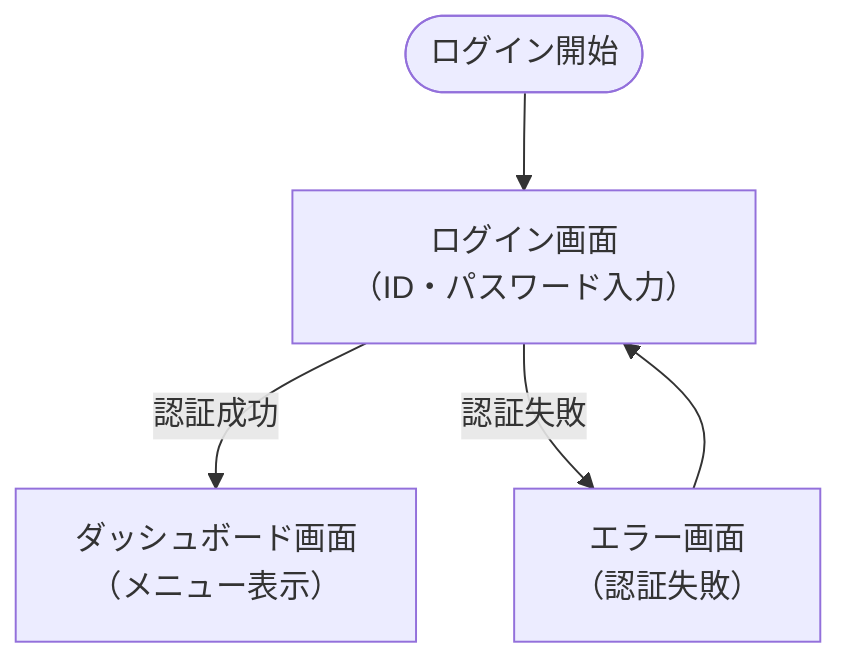

# 画面遷移図作成ルール

## 基本ルール

### ファイル保存場所
- **画面遷移図**: `docs/design/source/screen/diagram.rst` またはメイン図として
- **個別画面設計**: `docs/design/source/screen/` ディレクトリに個別ファイル
- **索引**: `docs/design/source/screen/index.rst` に新ファイルのリンクを追加

### テンプレート使用
- **画面遷移図**: `docs/design/source/screen/diagram.rst` をベースに作成
- **個別画面設計**: 必要に応じて個別ファイルを作成

### 用語・画面名統一
- 新しい用語・画面名は `docs/design/source/domain_model.rst` に定義を記述
- 画面遷移図で使用する画面名・用語は必ずdomain_modelに登録されているものを使用
- ユースケースで定義されたアクター・操作と整合性を保つ

## インプット情報と推奨ワークフロー

### 主要なインプット
1. **ユースケース図**: `docs/design/source/usecase/diagram.rst` に記載されたユースケース
2. **ユースケース記述**: `docs/design/source/usecase/*.rst` に記載された詳細な操作手順
3. **ドメインモデル**: `docs/design/source/domain_model.rst` に定義されたアクターと用語

### 推奨ワークフロー
1. **GitHubのissue確認**: 具体的な機能要求や不具合報告の詳細を理解
2. **ユーザーストーリー作成**: issue基準でAgile形式のユーザーストーリーを作成
3. **ドメインモデル作成**: アクターと用語を定義し、クラス図を作成
4. **ユースケース作成**: ユースケース図・記述を作成
5. **画面遷移図作成**: ユースケースから画面遷移を設計（← このステップ）
6. **データベース設計**: 必要に応じてER図とテーブル設計を作成

## テンプレート形式

```rst
画面遷移図
============================================

[ アクター名 ] の画面遷移フロー
--------------------------------------------

.. mermaid::

   %%{init: {"theme": "default"}}%%
   graph TD
       %% 開始・終了
       Start([開始])
       End([終了])
       
       %% 画面定義
       Screen1["画面1名<br/>（概要説明）"]
       Screen2["画面2名<br/>（概要説明）"]
       
       %% 遷移フロー
       Start --> Screen1
       Screen1 --> Screen2
       Screen2 --> End
       
       %% 条件分岐
       Screen1 -->|条件A| Screen2
       Screen1 -->|条件B| Screen3["画面3名"]
```

## 作成手順

### 1. ユースケースから画面遷移図を作成する場合

1. 対象のユースケース記述を確認し、基本コース・代替コースを理解
2. ユースケースの各ステップを画面操作に分解
3. 画面間の遷移関係を特定（進む・戻る・分岐・例外処理）
4. `docs/design/source/screen/diagram.rst` のテンプレートを使用
5. アクター毎に画面遷移フローを作成
6. 新しい画面名があれば `docs/design/source/domain_model.rst` に追加
7. `docs/design/source/screen/index.rst` にリンクを追加

### 2. 新しい画面遷移図ファイルを作成する場合

1. `docs/design/source/screen/` ディレクトリに新しい `.rst` ファイルを作成
2. テンプレート形式に従って作成
3. `docs/design/source/screen/index.rst` にリンクを追加

## 画面遷移図の要素

### 画面の表現
- **通常画面**: `Screen["画面名<br/>（説明）"]` （矩形）
- **入力画面**: `InputScreen["入力画面名<br/>（フォーム）"]` （矩形）
- **確認画面**: `ConfirmScreen["確認画面名<br/>（確認・実行）"]` （矩形）
- **完了画面**: `CompleteScreen["完了画面名<br/>（結果表示）"]` （矩形）

### 遷移の表現
- **通常遷移**: `Screen1 --> Screen2` （実線矢印）
- **条件分岐**: `Screen1 -->|条件| Screen2` （ラベル付き矢印）
- **戻る遷移**: `Screen2 --> Screen1` （逆方向矢印）

### 開始・終了の表現
- **開始**: `Start([開始])` （円形）
- **終了**: `End([終了])` （円形）
- **外部システム**: `External{外部システム名}` （菱形）

## ユースケースからの抽出ルール

### 基本コースからの抽出
1. **ユースケースの各ステップ**: 1つ以上の画面操作に対応
2. **アクターの操作**: 入力画面・選択画面として表現
3. **システムの処理**: 処理中画面・結果画面として表現
4. **確認・承認ステップ**: 確認画面として独立

### 代替コースからの抽出
1. **例外処理**: エラー画面・警告画面として表現
2. **条件分岐**: 条件付き遷移として表現
3. **中断・キャンセル**: キャンセル遷移として表現

### 事前条件・事後条件からの抽出
1. **事前条件**: 初期画面の前提条件として記載
2. **事後条件**: 完了画面・結果画面で満たすべき状態

## Mermaid記法のポイント（Sphinx + reStructuredText対応）

### 推奨記法（Sphinx環境で確実に動作）
- **実線矢印**: `Screen1 --> Screen2` （通常の遷移）
- **条件付き矢印**: `Screen1 -->|条件| Screen2` （条件分岐）
- **画面定義**: `ScreenName["画面名<br/>説明"]` （改行は`<br/>`使用）

### 使用可能なグラフタイプ
- **フローチャート**: `graph TD` （上から下）, `graph LR` （左から右）
- **画面遷移**: `graph TD` を推奨（縦方向の流れが自然）

### 避けるべき記法
- **点線矢印**: `-.->` （Sphinx環境でエラーの可能性）
- **複雑なノード形状**: 矩形以外の複雑な形状
- **日本語ラベル**: `: "日本語"` の複雑な使用
- **絵文字**: 環境によって表示されない可能性

### 推奨テンプレート例


## ファイル構造例

```
docs/design/source/screen/
├── diagram.rst          # メインの画面遷移図
├── user_flow.rst        # ユーザーフロー図
└── admin_flow.rst       # 管理者フロー図
```

## 注意事項

1. **ユースケースとの整合性**: 画面遷移はユースケースの基本コース・代替コースと必ず対応させる
2. **アクター毎に分離**: 一つの図にすべてのアクターを入れず、アクター毎に分けて見やすくする
3. **画面名の統一**: 同じプロジェクト内では画面名とスタイルを統一する
4. **遷移条件の明記**: 条件分岐では遷移条件を明確に記載する
5. **例外処理の考慮**: エラー処理・キャンセル処理の遷移も含める
6. **更新の連携**: ユースケース変更時は画面遷移図も合わせて更新する

## 画面遷移図と他設計文書の関連

### ユースケースとの関連
- **基本コース**: 正常な画面遷移フローとして表現
- **代替コース**: 例外・分岐の遷移として表現
- **事前・事後条件**: 開始・終了画面の状態として考慮

### ドメインモデルとの関連
- **アクター**: 画面遷移の主体として使用
- **エンティティ**: 画面で扱うデータオブジェクトとして参照
- **ビジネス概念**: 画面の業務的意味付けに活用

### データベース設計との関連
- **画面遷移**: データの作成・更新・削除タイミングを示す
- **データ整合性**: 画面間でのデータ状態変化を考慮

---

# 画面遷移図作成チェックリスト

## 作成前の確認事項
- [ ] 対象ユースケースの基本コース・代替コースを理解している
- [ ] 関連するアクター・エンティティをドメインモデルで確認済み
- [ ] 既存の画面遷移図との重複・矛盾がないか確認済み

## 作成時の確認事項
- [ ] 開始・終了点が明確に定義されている
- [ ] すべての画面に適切な名前と説明が付いている
- [ ] 遷移条件が明確に記載されている
- [ ] 例外処理・エラー処理の遷移が含まれている
- [ ] ユースケースのすべてのステップが画面遷移に反映されている

## 作成後の確認事項
- [ ] Mermaid記法がSphinx環境で正常に表示される
- [ ] `docs/design/source/screen/index.rst` にリンクが追加されている
- [ ] 新しい用語・画面名が `docs/design/source/domain_model.rst` に定義されている
- [ ] 関連するユースケース記述にこの画面遷移図へのリンクが追加されている

## screen/index.rst 運用ルール

### 基本構成（必須維持）

```rst
画面仕様
==============================================

.. toctree::
   :maxdepth: 1
   :caption: Contents:

   [画面仕様ファイル名]
```

### 新しい画面仕様ファイル追加時の手順

1. **toctree に追加**
   - 新しい画面仕様ファイル（例: `user_interface.rst`）を作成した場合
   - `screen/index.rst` の toctree に追加
   - ファイル名は拡張子（`.rst`）を除いて記載

2. **追加順序**
   - 機能の重要度順または作成日順に配置
   - 画面遷移図ファイルは上位に配置

3. **記載例**:
```rst
画面仕様
==============================================

.. toctree::
   :maxdepth: 1
   :caption: Contents:

   diagram
   user_interface
   admin_interface
```

### セクション構成ルール

- **タイトル**: 「画面仕様」で固定
- **toctree設定**: `:maxdepth: 1` と `:caption: Contents:` を使用
- **画面遷移図**: `diagram` ファイルを上位に配置
- **コメント**: Sphinx自動生成コメントは削除済み
