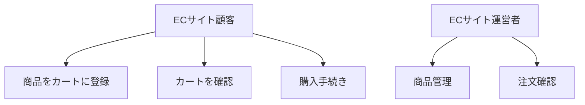

# ユースケース図・記述作成ルール

## 基本ルール

### ファイル保存場所
- **ユースケース図**: `docs/design/source/usecase/diagram.rst` またはメイン図として
- **個別ユースケース記述**: `docs/design/source/usecase/` ディレクトリに個別ファイル
- **索引**: `docs/design/source/usecase.rst` に新ファイルのリンクを追加

### テンプレート使用
- **ユースケース図**: `docs/design/source/usecase/diagram.rst` をベースに作成
- **ユースケース記述**: `docs/design/source/usecase/template.rst` をコピーして使用

### 用語・アクター統一
- 新しい用語・アクターは `docs/design/source/domain_model.rst` に定義を記述
- ユースケースで使用するアクター名・用語は必ずdomain_modelに登録されているものを使用

## インプット情報と推奨ワークフロー

### 主要なインプット
1. **GitHubのissue**: 具体的な機能要求や不具合報告
2. **ユーザーストーリー**: `docs/design/source/user_story/*.rst` に記載された要求（Agile形式）
3. **ドメインモデル**: `docs/design/source/domain_model.rst` に定義されたアクターと用語、クラス図

### 推奨ワークフロー
1. **GitHubのissue確認**: 具体的な機能要求や不具合報告の詳細を理解
2. **ユーザーストーリー作成**: issue基準でAgile形式（As a/I want/So that + Given-When-Then）のユーザーストーリーを作成
3. **ドメインモデル作成**: アクターと用語を定義し、クラス図を作成
4. **ユースケース作成**: ユースケース図・記述を作成（← このステップ）
5. **DDD設計作成**: エンティティ・値オブジェクト・集約・ドメインサービス・リポジトリの詳細設計
6. **ユースケースシーケンス図更新**: DDD設計要素をシーケンス図に反映（← 重要な追加ステップ）
7. **データベース設計**: 必要に応じてER図とテーブル設計を作成

## テンプレート形式

```rst
ユースケース図
============================================

[ アクター名 ] が行えるユースケース
--------------------------------------------

.. mermaid::

   %%{init: {"theme": "default"}}%%
   graph TB
       %% アクター定義
       Actor["🔸<br/>[ アクター名 ]"]
       
       %% ユースケース定義
       UseCase1["[ ユースケース1 ]"]
       UseCase2["[ ユースケース2 ]"]
       
       %% アクターとユースケースの関係
       Actor -.-> UseCase1
       Actor -.-> UseCase2
```

## 作成手順

### 1. GitHubのissueからユースケース図を作成する場合

1. GitHubのissueを確認し、アクターとユースケースを特定
2. `docs/design/source/usecase/diagram.rst` のテンプレートを使用
3. アクター毎にセクションを分けて図を作成
4. 新しい用語があれば `docs/design/source/domain_model.rst` に追加
5. `docs/design/source/usecase.rst` にリンクを追加

### 2. 新しいユースケース図ファイルを作成する場合

1. `docs/design/source/usecase/` ディレクトリに新しい `.rst` ファイルを作成
2. テンプレート形式に従って作成
3. `docs/design/source/usecase.rst` にリンクを追加

### 3. DDD設計後のシーケンス図更新

DDD設計完了後、既存のユースケースシーケンス図を詳細化します：

1. **対象DDD設計文書の確認**: `docs/design/source/ddd/[バウンデッドコンテキスト名].rst` の内容を理解
2. **既存シーケンス図の確認**: 更新対象のユースケースファイルのシーケンス図を確認
3. **DDD要素の追加**: 以下の要素をシーケンス図に反映
   - **エンティティ**: ビジネス概念を表現するオブジェクト
   - **値オブジェクト**: 不変の値を表現するオブジェクト
   - **集約**: 関連するエンティティと値オブジェクトをまとめたもの
   - **ドメインサービス**: エンティティや値オブジェクトに属さないビジネスロジック
   - **リポジトリ**: データの永続化を抽象化するインターフェース
4. **ビジネスルール適用**: ドメインサービスやエンティティのビジネスルールを適切なタイミングで実行
5. **基本コース・代替コースとの整合性確認**: 元のユースケース記述との一貫性を保つ

#### DDD設計要素を含むシーケンス図のテンプレート例

```mermaid
%%{init: {"theme": "default"}}%%
sequenceDiagram
    participant Actor as アクター
    participant Controller as コントローラー
    participant DomainService as ドメインサービス
    participant Entity as エンティティ
    participant ValueObject as 値オブジェクト
    participant Repository as リポジトリ
    participant Database as データベース
    
    Actor->>Controller: リクエスト
    Controller->>DomainService: ビジネスロジック実行
    DomainService->>Repository: エンティティ取得
    Repository->>Database: データ取得
    Database-->>Repository: データ返却
    Repository-->>DomainService: エンティティ返却
    DomainService->>ValueObject: 値オブジェクト作成
    ValueObject-->>DomainService: 値オブジェクト返却
    DomainService->>Entity: ビジネスルール適用
    Entity-->>DomainService: 処理結果
    DomainService->>Repository: エンティティ保存
    Repository->>Database: データ保存
    Database-->>Repository: 保存完了
    Repository-->>DomainService: 保存完了
    DomainService-->>Controller: 処理結果
    Controller-->>Actor: レスポンス
```

## アクターアイコン

- 👤 一般ユーザー（顧客、利用者）
- 👥 管理者、運営者
- 🖥️ システム、外部システム
- 🔸 その他のアクター

## Mermaid記法のポイント（Sphinx + reStructuredText対応）

### 推奨記法（Sphinx環境で確実に動作）
- **シンプルな矢印**: `Actor --> UseCase` （実線矢印）
- **アクター定義**: `ActorName[表示名]` （シンプルな形式）
- **ユースケース定義**: `UseCaseName[ユースケース名]` （シンプルな形式）

### 使用可能なグラフタイプ
- **フローチャート**: `graph TD` （上から下）, `graph LR` （左から右）
- **シンプルな図**: 複雑なER図記法やクラス図記法は避ける

### 避けるべき記法
- **点線矢印**: `-.->` （Sphinx環境でエラーの可能性）
- **複雑なリレーション**: `||--||`, `||--o{` など
- **日本語ラベル付きリレーション**: `: "日本語"` （エラーの原因）
- **絵文字**: `🔸` など（環境によって表示されない）

### 推奨テンプレート例


## ファイル構造例

```
docs/design/source/usecase/
├── diagram.rst          # メインのユースケース図
├── shopping_flow.rst    # ショッピングフロー図
└── admin_tasks.rst      # 管理者タスク図
```

## 注意事項

1. **アクター毎に分離**: 一つの図にすべてのアクターを入れず、アクター毎に分けて見やすくする
2. **簡潔な表現**: ユースケース名は動詞で始まり、簡潔に表現する
3. **日本語と英語**: 必要に応じて英語併記も可能
4. **一貫性**: 同じプロジェクト内では用語とスタイルを統一する
5. **更新**: issueやユーザーストーリーの変更に応じて図も更新する

---

# ユースケース記述作成ルール

## 基本ルール

### ファイル管理
1. **ファイル保存場所**: `docs/design/source/usecase/` ディレクトリに保存
2. **テンプレート使用**: `docs/design/source/usecase/template.rst` をコピーして使用
3. **ファイル命名規則**: `[ 機能名 ]_[ 動作 ].rst` （例: `shopping_cart_registration.rst`）
4. **索引への追加**: `docs/design/source/usecase/index.rst` の `.. toctree::` セクションにリンクを追加

### 用語・設計統一
5. **ドメインモデル連携**: 新しいアクターや用語は `docs/design/source/domain_model.rst` に定義を追加
6. **データベース連携**: データ構造が関わる場合は `docs/design/source/database/er.rst` も参照・更新
7. **ユーザーストーリー連携**: 対応する `docs/design/source/user_story/*.rst` を参照

### Git運用
8. **コミット**: ユースケース作成時は関連ファイル更新も含めてコミット
9. **メッセージ**: 「ユースケース: [機能名] - [概要説明]」形式

## テンプレート構造

```rst
[ ユースケース名 ]
==========================================

関連ユーザーストーリー
--------------------------------------------

* :doc:`../user_story/[ユーザーストーリーファイル名]`

アクター
--------------------------------------------
**主アクター**: [ メインのアクター名 ]
**副アクター**: [ サポートするアクター名（複数可）]

事前条件
--------------------------------------------
- [ 条件1 ]
- [ 条件2 ]

事後条件
--------------------------------------------
**成功時**:
- [ 成功時の状態1 ]
- [ 成功時の状態2 ]

**失敗時**:
- [ 失敗時の状態 ]

基本コース
--------------------------------------------
1. [ アクター ] が [ アクション ] する
2. システムが [ 処理 ] する
...
8. ユースケース終了

代替コース
--------------------------------------------
**[ ステップ番号 ]a. [ 例外状況 ]の場合**:
[ ステップ番号 ]a1. [ 例外処理1 ]
[ ステップ番号 ]a2. [ 例外処理2 ]
[ ステップ番号 ]a3. ユースケース終了

シーケンス図
--------------------------------------------
.. mermaid::
   [ Mermaidシーケンス図 ]
```

## 作成手順

### 1. GitHubのissueからユースケース記述を作成する場合

1. **インプット情報の収集**:
   - GitHubのissueの内容を確認
   - 関連する `docs/design/source/user_story/*.rst` のユーザーストーリーを参照（As a/I want/So that + Given-When-Then形式）
   - `docs/design/source/domain_model.rst` でアクターと用語の定義、クラス図を確認
   - 必要に応じて `docs/design/source/database/er.rst` でデータ構造を確認

2. **ユースケースの分析**:
   - **主アクター**: ユーザーストーリーの「As a」から特定
   - **目的**: ユーザーストーリーの「So that」から特定
   - **具体的な行動**: ユーザーストーリーの「I want」から特定
   - **シナリオ**: Given-When-Then形式の受け入れ条件を参照

3. **ファイル作成**:
   - `source/usecase/template.rst` をコピーして新しいファイルを作成
   - ファイル名は `[ 機能名 ]_[ 動作 ].rst` 形式で命名

4. **記述作成**:
   - 関連ユーザーストーリーへのリンクを設定（`:doc:`../user_story/[ファイル名]``）
   - テンプレートの各セクションを具体的に記述
   - ユーザーストーリーの受け入れ条件（Given-When-Then）を基本コースに反映
   - ドメインモデルクラス図とER図の整合性を確認

5. **関連ファイル更新**:
   - 新しいアクターや用語を `source/domain_model.rst` に追加
   - データベース関連の場合は `source/database/er.rst` も更新検討
   - `source/usecase.rst` にリンクを追加

6. **Git運用**:
   - 関連ファイル更新を含めてコミット
   - 「ユースケース: [機能名] - [概要説明]」形式でコミットメッセージ作成

### 2. 各セクションの記述ガイドライン

#### 関連ユーザーストーリー
- 対応するユーザーストーリーファイルへのSphinxリンクを記載
- `:doc:`../user_story/[ファイル名]`` 形式で記述
- トレーサビリティ確保のため必須

#### アクター
- **主アクター**: ユースケースを開始するアクター（必須）
- **副アクター**: システムや外部サービスなど、処理に関わるアクター

#### 事前条件
- ユースケース開始前に満たされている必要がある条件
- システムの状態、ユーザーの状態、データの状態など

#### 事後条件
- **成功時**: ユースケースが正常終了した場合の状態
- **失敗時**: ユースケースが異常終了した場合の状態

#### 基本コース
- 正常なシナリオでの処理手順
- ステップは動作の順序で番号付け
- 最後は「ユースケース終了」で締める

#### 代替コース
- エラーや例外的な状況での処理手順
- 基本コースのステップ番号 + a, b, c... で識別
- 各代替コースは独立して記述

#### シーケンス図
- MermaidのsequenceDiagramを使用
- アクター、UI、コントローラー、サービス、データベースなどの相互作用を表現

## ユースケース名の命名規則

- **動詞 + 目的語**の形式で命名
- 例: 「商品をカートに登録する」「ユーザー情報を更新する」「注文履歴を表示する」

## 代替コースのパターン

1. **入力エラー**: 不正な入力値による例外処理
2. **システムエラー**: サーバーエラーやネットワークエラー
3. **権限エラー**: アクセス権限不足による例外処理
4. **データ不整合**: 期待するデータが存在しない場合
5. **外部システムエラー**: 連携する外部システムの障害

## 品質チェックポイント

1. **完全性**: すべてのセクションが適切に記述されているか
2. **明確性**: 曖昧な表現がなく、具体的に記述されているか
3. **一貫性**: 用語やアクター名が統一されているか
4. **実装可能性**: 実際の開発で使用できるレベルの詳細度か
5. **保守性**: 要件変更時に修正しやすい構造になっているか
6. **索引管理**: `docs/design/source/usecase/index.rst`にファイルリンクが追加されているか

## usecase/index.rst 運用ルール

### 基本構成（必須維持）

```rst
ユースケース 一覧
============================================

.. toctree::
   :maxdepth: 1

   [ユースケース記述ファイル名]
   diagram
   template
```

### 新しいユースケース記述ファイル追加時の手順

1. **「ユースケース 一覧」セクションに追加**
   - 新しいユースケース記述ファイル（例: `shopping_cart.rst`）を作成した場合
   - `usecase/index.rst` の toctree に追加
   - ファイル名は拡張子（`.rst`）を除いて記載

2. **追加順序**
   - 機能の重要度順または作成日順に配置
   - `diagram` と `template` は常に最後に配置
   - `diagram` → `template` の順序を維持

3. **記載例**:
```rst
ユースケース 一覧
============================================

.. toctree::
   :maxdepth: 1

   member_registration
   shopping_cart
   user_authentication
   diagram
   template
```

### セクション構成ルール

- **タイトル**: 「ユースケース 一覧」で固定
- **toctree設定**: `:maxdepth: 1` を使用
- **固定ファイル**: `diagram` と `template` は常に最後
- **順序**: 個別記述 → diagram → template の順序を維持

## 関連ファイル

- `docs/design/source/usecase.rst` - ユースケース図・記述の索引
- `docs/design/source/usecase/template.rst` - ユースケース記述テンプレート  
- `docs/design/source/usecase/diagram.rst` - ユースケース図テンプレート
- `docs/design/source/domain_model.rst` - プロジェクト用語定義
- `docs/design/source/user_story.rst` - ユーザーストーリー
- `.cursor/user_story.md` - ユーザーストーリー作成ルール

## 用語・アクター名の統一ルール

- **アクター名**: `docs/design/source/domain_model.rst` のアクターセクションに定義されている名称を使用
- **専門用語**: `docs/design/source/domain_model.rst` の用語セクションに定義されている用語を使用  
- **新しいアクター・用語**: ユースケース作成前に必ず `docs/design/source/domain_model.rst` に追加してから使用
- **表記揺れ防止**: 同じ概念に対して複数の表現を使わず、domain_modelの定義に統一
