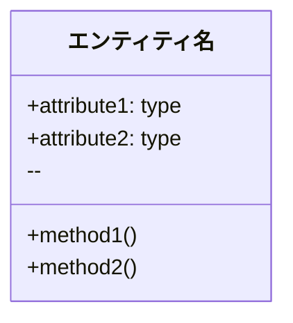
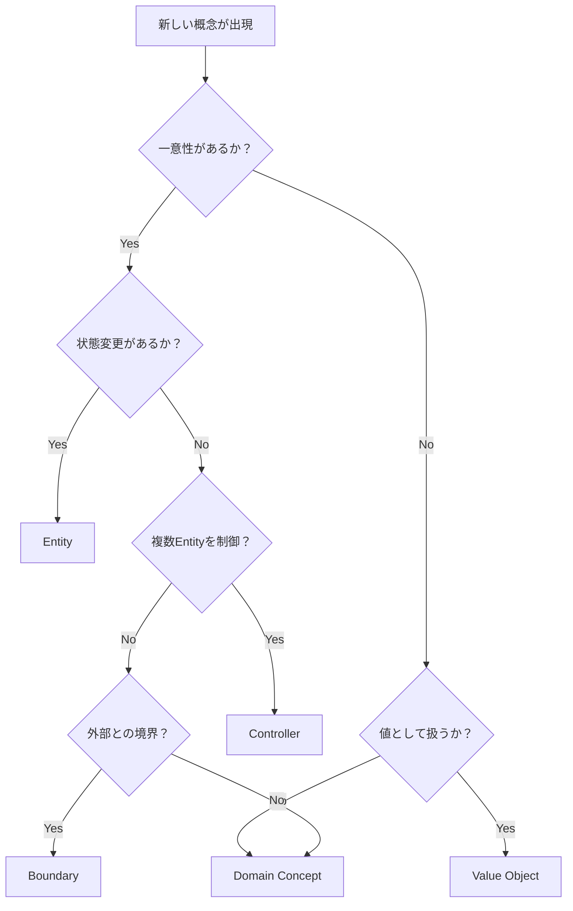

# ドメインモデル作成ルール

このプロジェクトでドメインモデルを作成・更新する際の標準ルールです。

## 基本ルール

### 1. ファイル保存場所
- ドメインモデル定義: `source/domain_model.rst`（単一ファイル管理、テンプレート形式）
- 用語・概念の統一管理を目的とする

### 2. 設計パターンの適用
- **ECBパターン（Entity-Control-Boundary）**: システム要素の責務分離
- **DDD（ドメイン駆動設計）**: ビジネス概念と値オブジェクトの明確化
- **統一ワークフロー**: issue → ユーザーストーリー → **ドメインモデル** → ユースケース

### 3. 用語・概念の統一
- 新しいアクター、エンティティ、用語は必ずドメインモデルに定義
- プロジェクト全体で一貫した用語を使用
- 設計パターン別の分類を維持

### 4. Git運用
- ドメインモデル更新時は適切なコミットメッセージでコミット・プッシュ
- 関連する他の設計文書と同時に更新する場合は同じコミットに含める

## テンプレートの使用方法

`source/domain_model.rst`はテンプレートファイルとして汎用化されています。新しいプロジェクトや機能追加時は以下の手順で使用してください。

### テンプレート活用手順

1. **プレースホルダーの確認**
   - `[プロジェクト名]`、`[アクター名]`、`[エンティティ名]`等の`[ ]`で囲まれた部分を特定

2. **参考例の確認**
   - HTMLコメント`<!-- ECサイトの例: ... -->`内にECサイトの具体例が記載
   - ビジネスドメインに応じて参考にする

3. **プレースホルダーの置き換え**
   - `[アクター名]` → ユーザーストーリーから抽出されたアクター
   - `[エンティティ名]` → 業務で使用される具体的なエンティティ名
   - `[ビジネス概念]` → ドメイン固有の業務概念

4. **設計パターン別の内容追加**
   - アクター: ユーザーストーリーの「As a [アクター]」から抽出
   - エンティティ: 一意性を持つオブジェクトを定義
   - コントローラ: ビジネスロジックの制御部分を特定
   - バウンダリ: 外部システム連携やUI部分を明確化
   - ビジネス概念: ドメイン固有の重要概念を定義
   - 値オブジェクト: 不変値として扱うべき概念を特定

5. **Mermaidクラス図の更新**
   - プレースホルダーを実際のクラス名に置き換え
   - リレーションシップを業務ルールに合わせて調整

6. **HTMLコメントの保持**
   - 将来の参考のため、HTMLコメント内の例は削除しない
   - 新しい例を追加する場合は同様の形式で記載

### テンプレート使用時の注意点

- **段階的な更新**: 一度にすべてを埋めるのではなく、ユーザーストーリーごとに段階的に更新
- **既存内容の確認**: 新しい概念を追加する前に、既存の定義と重複がないかチェック
- **命名規則の統一**: エンティティ名や概念名は統一された命名規則に従う
- **ビジネス価値の明確化**: 技術的詳細よりもビジネス価値を優先して記述

## インプット情報

ドメインモデル作成時に参照すべき情報源：

### 主要なインプット
- **GitHubのissue**: 機能要求で出現する業務概念
- **ユーザーストーリー**: Agile形式で記述された要求から抽出される用語・アクター
- **既存のドメインモデル**: 用語・概念の統一性維持

### 補助的なインプット
- **業務知識**: ドメインエキスパートからの情報
- **既存システム**: レガシーシステムで使用されている用語

## 推奨ワークフロー

1. **GitHubのissue確認**: 機能要求の詳細を理解
2. **ユーザーストーリー参照**: 前ステップで作成されたユーザーストーリーを確認
3. **ドメインモデル作成**（← このステップ）
   - 新しい用語・アクター・概念を抽出
   - 設計パターン別に分類
   - `source/domain_model.rst` を更新
   - 必要に応じてMermaidクラス図を作成・更新
4. **ユースケース作成**: ドメインモデルに基づいてユースケースを設計
5. **データベース設計**: エンティティからテーブル設計に展開

## 設計パターン別分類

### エンティティ（Entity）
**特徴**: 
- 一意性を持つオブジェクト（IDで識別）
- ライフサイクルがある
- 状態変更が可能

**判断基準**:
- 「このオブジェクトは他と区別できる一意性があるか？」
- 「時間経過とともに状態が変わるか？」

**記述ルール**:
- エンティティ名（日本語・英語併記）
- 主要属性（ID、基本情報、状態）
- 主要操作（メソッド相当）

### コントローラ（Controller）
**特徴**:
- ビジネスロジックの実行
- エンティティ間の協調制御
- ワークフローの管理

**判断基準**:
- 「このロジックは複数のエンティティにまたがるか？」
- 「ビジネスルールの実行責任を持つか？」

**記述ルール**:
- 管理対象の明確化
- 主要な処理フロー
- 制御するビジネスルール

### バウンダリ（Boundary）
**特徴**:
- システム境界での入出力処理
- 外部システムとの連携
- ユーザーインターフェース

**判断基準**:
- 「外部システムとの通信を行うか？」
- 「ユーザーからの入力を受け付けるか？」

**記述ルール**:
- 連携先システム・UI
- 入出力データ形式
- プロトコル・インターフェース

### ビジネス概念（Domain Concepts）
**特徴**:
- ドメイン固有のビジネスルール
- 業務知識の明文化
- システム横断的な概念

**判断基準**:
- 「業務特有の重要な概念か？」
- 「システム全体で共通理解が必要か？」

**記述ルール**:
- ビジネス上の意味・価値
- 適用条件・制約
- 関連する他の概念

### 値オブジェクト（Value Objects）
**特徴**:
- 不変オブジェクト
- 値による等価性判断
- 型安全性の向上

**判断基準**:
- 「値そのものが重要で、同一性は不要か？」
- 「不変であるべきか？」

**記述ルール**:
- 値の形式・制約
- バリデーションルール
- 不変性の保証

## Mermaidクラス図作成ルール

### 基本記法（Sphinx環境対応）


### 推奨記法
- **クラス定義**: `class EntityName["日本語名"]`
- **属性**: `+attribute_name: data_type`
- **メソッド**: `+methodName()`
- **リレーション**: `ClassA --> ClassB`（シンプルな矢印）

### 避けるべき記法
- 複雑なリレーション記法（`||--||`、`||--o{`など）
- 日本語ラベル付きリレーション（`: "関係名"`）
- 点線矢印（`-.->` ）
- 絵文字やスペシャル文字

## ファイル構造

```
source/domain_model.rst（テンプレートファイル）
├── アクター                    ← プレースホルダー[ ]を置き換えて使用
├── エンティティ（Entity）       ← 設計パターン別に分類
├── コントローラ（Controller）   ← HTMLコメント内の例を参考
├── バウンダリ（Boundary）
├── ビジネス概念（Domain Concepts）
├── 値オブジェクト（Value Objects）
└── ドメインモデル クラス図      ← Mermaidでクラス名も更新
```

## 品質チェック

### 作成時チェックポイント
- [ ] ユーザーストーリーの新しい用語がすべて定義されている
- [ ] 設計パターン別の分類が適切にされている
- [ ] アクターが明確に識別されている
- [ ] エンティティに一意性（ID）が定義されている
- [ ] 値オブジェクトの不変性が明記されている
- [ ] Mermaidクラス図がSphinx環境で表示される

### テンプレート使用時の追加チェック
- [ ] すべてのプレースホルダー`[ ]`が適切な内容に置き換えられている
- [ ] HTMLコメント内の参考例を確認して適切に活用している
- [ ] 新しい概念が既存の定義と重複していない
- [ ] プロジェクト固有の命名規則に従っている
- [ ] 段階的更新の場合、既存内容との整合性が保たれている

### レビューポイント
- [ ] 用語の一貫性が保たれている
- [ ] ビジネス価値が明確に示されている
- [ ] 設計パターンの適用が適切
- [ ] クラス図が論理的に整合している
- [ ] 他の設計文書との整合性がある

## 他の設計文書との連携

### ユーザーストーリーとの関係
- ユーザーストーリーで出現した新しい用語・アクターを定義
- As a **[アクター]** の部分はドメインモデルのアクターと一致させる
- ビジネス価値をドメイン概念として抽象化

### ユースケースとの関係
- ドメインモデルのアクターをユースケースで使用
- エンティティとコントローラがユースケースのロジックに対応
- 用語の一貫性を保つ

### データベース設計との関係
- エンティティがテーブル設計の基準となる
- 値オブジェクトがカラム設計に影響
- リレーションシップがER図に反映

## 設計パターン判断フローチャート



## 注意事項

### 必須事項
- 新しい用語は必ずドメインモデルに定義すること
- 設計パターンの分類を必ず実施すること
- ユーザーストーリーとの整合性を保つこと
- Mermaid図はSphinx環境で動作する形式を使用すること

### 品質向上のために
- ビジネス価値を常に意識すること
- ドメインエキスパートとの対話を重視すること
- 実装可能性を考慮すること
- チームメンバーとの用語統一を図ること

## よくある問題と解決方法

### 用語の重複・不一致
**問題**: 同じ概念が複数の名前で定義される  
**解決**: 定期的に用語集をレビューし、統合・整理する

### 設計パターンの判断迷い
**問題**: EntityかValue Objectか判断に迷う  
**解決**: 判断フローチャートを参照し、一意性と不変性で判断

### Mermaid図の表示エラー
**問題**: クラス図が正しく表示されない  
**解決**: 推奨記法を使用し、複雑な記法を避ける

### 他文書との不整合
**問題**: ユースケースで使用される用語がドメインモデルにない  
**解決**: 設計文書作成時にドメインモデルを必ず参照・更新

## 関連文書

- **統一ワークフロー**: `.cursor/workflow.md`
- **ユーザーストーリー作成**: `.cursor/user_story.md`
- **ユースケース作成**: `.cursor/usecase.md`
- **データベース設計**: `.cursor/database.md`
- **Git運用**: `.cursor/git.md` 