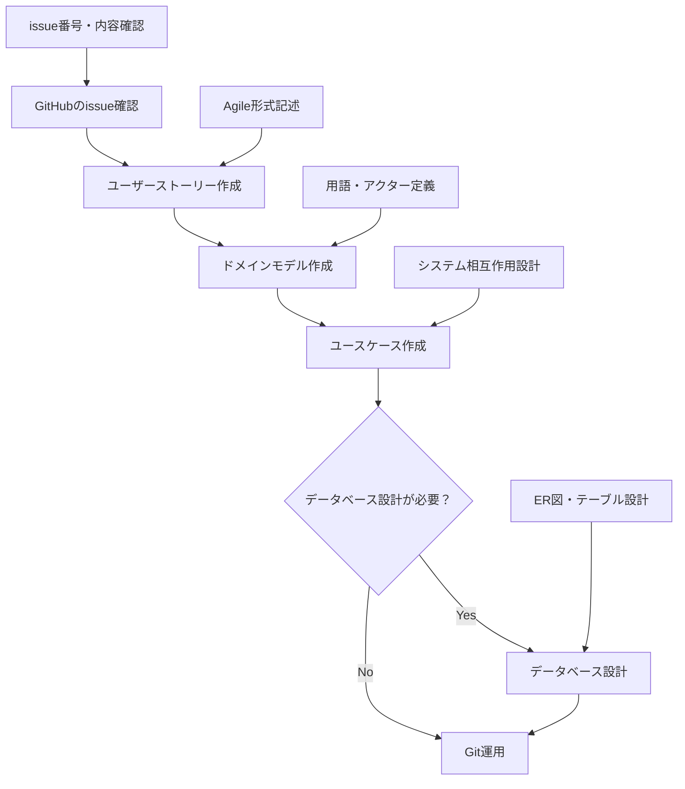

# プロジェクト設計ワークフロー

このプロジェクトにおける統一された設計手順とワークフローです。すべての機能開発は、この順序に従って実施してください。

## 基本ワークフロー

### 1. GitHubのissue確認
**目的**: 機能要求や課題の詳細を理解する  
**インプット**:
- GitHubのissue（課題・要求の詳細）

**作業内容**:
- issue番号、タイトル、詳細内容を確認
- 要求の背景と期待される結果を理解
- 関連するissueや依存関係を把握

**成果物**: issue内容の理解

---

### 2. ユーザーストーリー作成
**目的**: ユーザー視点での価値を明確にする  
**インプット**:
- 前ステップで確認したGitHubのissue
- `source/user_story/template.rst`（テンプレートファイル）

**作業内容**:
- `source/user_story/template.rst` をコピー
- Agile形式（As a/I want/So that）でユーザーストーリーを記述
- Given-When-Thenシナリオで受け入れ条件を定義
- `source/user_story.rst` の `toctree` に新ファイルを追加

**成果物**: `source/user_story/[機能名].rst`  
**参照ルール**: `.cursor/user_story.md`

---

### 3. ドメインモデル作成
**目的**: 用語統一とシステム全体の概念を定義する  
**インプット**:
- 前ステップで作成したユーザーストーリー
- 既存の `source/domain_model.rst`（用語・概念の統一のため）

**作業内容**:
- ユーザーストーリーで新しく出てきた用語・アクターを定義
- `source/domain_model.rst` に用語説明を追加
- 必要に応じてMermaidクラス図を作成・更新
- システム内の関係性を明確化

**成果物**: 更新された `source/domain_model.rst`

---

### 4. ユースケース作成
**目的**: システムとユーザーの相互作用を設計する  
**インプット**:
- 前ステップで作成したユーザーストーリー
- 前ステップで更新したドメインモデル（アクター・用語定義）
- `source/usecase/template.rst`（必要に応じて）

**作業内容**:
- ユースケース図の作成（Mermaid形式）
- ユースケース記述の作成（必要に応じて）
- アクターとシステムの相互作用を定義
- `source/usecase.rst` への索引追加

**成果物**: `source/usecase/[機能名].rst`  
**参照ルール**: `.cursor/usecase.md`

---

### 5. データベース設計（必要に応じて）
**目的**: データ構造とデータベース設計を定義する  
**インプット**:
- 前ステップで作成したユーザーストーリー
- 前ステップで更新したドメインモデル（エンティティ・クラス図）
- 前ステップで作成したユースケース（データの流れ・操作）
- 既存の `source/database/er.rst`（既存設計との整合性のため）

**作業内容**:
- ER図の作成・更新（`source/database/er.rst`）
- テーブル設計書の作成（必要に応じて）
- データ整合性とビジネスルールの定義

**成果物**: 更新された `source/database/er.rst`  
**参照ルール**: `.cursor/database.md`

## ワークフロー図



## ワークフロー一覧表

| ステップ | インプット | 成果物 |
|----------|------------|--------|
| 1. GitHubのissue確認 | GitHubのissue | issue内容の理解 |
| 2. ユーザーストーリー作成 | issue + `user_story/template.rst` | `user_story/[機能名].rst` |
| 3. ドメインモデル作成 | ユーザーストーリー + 既存`domain_model.rst` | 更新された`domain_model.rst` |
| 4. ユースケース作成 | ユーザーストーリー + ドメインモデル + `usecase/template.rst` | `usecase/[機能名].rst` |
| 5. データベース設計 | ユーザーストーリー + ドメインモデル + ユースケース + 既存`database/er.rst` | 更新された`database/er.rst` |

## ファイル構造とルール

### 設計文書の配置
```
source/
├── user_story.rst           # ユーザーストーリー一覧
├── domain_model.rst         # ドメインモデル・用語定義
├── usecase.rst             # ユースケース一覧
├── database.rst            # データベース設計一覧
├── user_story/
│   ├── template.rst        # Agileテンプレート
│   └── [機能名].rst        # 個別ユーザーストーリー
├── usecase/
│   ├── diagram.rst         # ユースケース図
│   ├── template.rst        # ユースケーステンプレート
│   └── [機能名].rst        # 個別ユースケース
└── database/
    ├── er.rst              # ER図
    ├── template.rst        # テーブル設計テンプレート
    └── table_list.rst      # テーブル一覧
```

### ルール文書の配置
```
.cursor/
├── workflow.md             # 統一ワークフロー（このファイル）
├── user_story.md          # ユーザーストーリー作成ルール
├── usecase.md             # ユースケース作成ルール
├── database.md            # データベース設計ルール
└── git.md                 # Git運用ルール
```

### index.rst管理ルール

各フォルダには必ず `index.rst` ファイルを配置し、そのフォルダ内のすべてのファイルへのリンクを設定してください。

#### 必須対応
- **新ファイル作成時**: 対応する `index.rst` の `.. toctree::` セクションに追加
- **ファイル削除時**: 対応する `index.rst` からリンクを削除
- **ファイル名変更時**: 対応する `index.rst` のリンクも更新

#### フォルダ別index.rstファイル
- `source/user_story/index.rst`: ユーザーストーリーファイル一覧
- `source/usecase/index.rst`: ユースケースファイル一覧  
- `source/database/index.rst`: データベース設計ファイル一覧

#### 標準構造
```rst
[フォルダ名] 一覧
============================================

.. toctree::
   :maxdepth: 1

   [実際のファイル名1]
   [実際のファイル名2]
   template
```

#### 注意事項
- ファイル名は拡張子（`.rst`）を除いて記載
- `template.rst` は通常最後に配置
- フォルダ相対パスで記載（`user_story/` 等の接頭辞は不要）

## 品質チェック

### 各ステップでのチェックポイント

#### ユーザーストーリー
- [ ] GitHubのissueと内容が一致している
- [ ] Agile形式（As a/I want/So that）で記述されている
- [ ] 受け入れ条件が具体的で測定可能
- [ ] 3つのシナリオ（成功+異常パターン）が記述されている

#### ドメインモデル
- [ ] 新しい用語がすべて定義されている
- [ ] アクターが明確に識別されている
- [ ] クラス図が論理的に整合している
- [ ] 用語の一貫性が保たれている

#### ユースケース
- [ ] ユーザーストーリーと整合している
- [ ] ドメインモデルの用語が使用されている
- [ ] システムとアクターの相互作用が明確
- [ ] Mermaid図が正しく表示される

#### データベース設計
- [ ] ドメインモデルのクラス図と整合している
- [ ] ER図にすべてのエンティティが含まれている
- [ ] データ整合性制約が適切に定義されている

#### ファイル管理（全ステップ共通）
- [ ] 新規作成したファイルが対応するindex.rstに追加されている
- [ ] index.rstのtoctreeに記載されたファイルが実際に存在する
- [ ] template.rstが各フォルダの最後に配置されている
- [ ] ファイル名がindex.rstとファイルシステムで一致している

## Git運用

### コミットタイミング
- **ユーザーストーリー作成後**: 「ユーザーストーリー: [機能名] - [概要]」
- **ドメインモデル更新後**: 「ドメインモデル: [用語追加/クラス図更新] - [概要]」
- **ユースケース作成後**: 「ユースケース: [機能名] - [概要]」
- **データベース設計後**: 「データベース設計: [テーブル追加/ER図更新] - [概要]」

### 推奨コミット粒度
- 各ステップごとに個別コミット
- 関連ファイルの更新（索引追加など）は同じコミットに含める
- 大きな機能の場合は、ブランチを切って作業

## 注意事項

### 必須事項
- ワークフローの順序を必ず守ること
- 新しい用語は必ずドメインモデルに定義すること
- Agile形式のユーザーストーリーを維持すること
- Mermaid図はSphinx環境で動作する形式を使用すること

### 品質向上のために
- 各ステップで前段階の成果物を参照すること
- 設計文書間の整合性を定期的にチェックすること
- チームメンバーとの用語統一を図ること
- 実装可能性を常に考慮すること

## 関連文書

- **ユーザーストーリー作成**: `.cursor/user_story.md`
- **ユースケース作成**: `.cursor/usecase.md`
- **データベース設計**: `.cursor/database.md`
- **Git運用**: `.cursor/git.md`

## トラブルシューティング

### よくある問題と解決方法

#### Mermaid図が表示されない
- Sphinxでサポートされていない記法を使用していないか確認
- 日本語ラベルや複雑なリレーション記法を避ける
- `.cursor/usecase.md` の推奨記法を参照

#### 用語の不一致
- すべての設計文書で同じ用語を使用する
- 新しい用語は必ず `source/domain_model.rst` に定義
- 定期的に用語の一貫性をチェック

#### ワークフローの迷い
- このワークフロー文書に立ち戻る
- 必要に応じて各ステップの詳細ルールを確認
- チームで議論して判断を統一 